这是一个完整的 **Tacit 项目功能与流程说明书**。它综合了我们之前的对话（关于无鉴权身份、支付流、实时控制）以及 Partiful 截图中的视觉和功能细节（组织、广播、动态流）。

你可以直接将此文档作为 **PRD (产品需求文档)** 提供给 Cursor 或开发团队。

-----

# Tacit: Project Functional Specification & User Flows

## 1\. 核心流程 (Core Processes)

### 流程 A: "零摩擦" 匿名参与流程 (No-Auth Guest Flow)

**痛点解决:** 访客无需注册即可投票和报名，系统自动识别身份。

```mermaid
sequenceDiagram
    participant Guest as 访客 (Browser)
    participant App as 前端 (Vue)
    participant DB as 后端 (Supabase)

    Guest->>App: 打开分享链接 (e.g., tacit.app/e/xyz)
    App->>App: 检查 LocalStorage 是否有 'guest_uuid'
    
    alt 无 UUID (首次访问)
        App->>App: 生成新 UUID (uuidv4)
        App->>App: 存入 LocalStorage
    else 有 UUID (回头客)
        App->>App: 读取现有 UUID
    end

    Guest->>App: 点击 "Vote" 或 "RSVP"
    
    rect rgb(20, 20, 20)
        Note over Guest, App: 身份确认弹窗
        App-->>Guest: 询问 "你的名字是?" (仅首次需要)
        Guest->>App: 输入 "Mike"
    end

    App->>DB: 提交数据 (Payload: { guest_id: UUID, name: "Mike", status: "Yes" })
    DB->>DB: 记录到 guest_identities 表 & rsvps 表
    DB-->>App: 返回成功
    App->>Guest: 显示 "You're in!" 并订阅实时更新
```

### 流程 B: "寻找时间" 决策闭环 (Date Polling Loop)

**痛点解决:** 解决多人时间协调困难，主持人拥有最终决定权。

1.  **Host 发起:** 创建活动时选择 "Decide later"，并添加 3-5 个候选时间槽 (Time Slots)。
2.  **Guest 投票:** 访客进入页面，看到时间选项网格。
      * 选择：`Can do` (绿色), `If need be` (黄色), `Can't do` (灰色)。
      * 提交后实时更新票数统计。
3.  **智能推荐:** 系统自动计算交集，标记 "Most Popular" 的选项。
4.  **Host 锁定:** 主持人点击 "Lock this date"。
      * **后端动作:** 更新 `events` 表状态 `polling` -\> `scheduled`，写入最终 `start_time`。
      * **通知:** 触发 System Blast，通知所有已投票用户 "时间已定"。

### 流程 C: 定额 AA 支付流程 (Split Payments)

**痛点解决:** 避免活动后催账尴尬，报名即付费。

1.  **配置:** Host 在活动设置中开启 "Chip In"，设定金额 (e.g., $20/人) 并绑定 Stripe Connect 账户。
2.  **RSVP 拦截:** 访客点击 "I'm Going"。
3.  **支付网关:**
      * 前端调用 Supabase Edge Function (`create-checkout`).
      * 返回 Stripe Checkout URL。
      * 用户跳转至 Stripe 完成支付。
4.  **回调销账:**
      * Stripe Webhook 触发后端逻辑。
      * 更新 `rsvps` 表 `payment_status` = `'paid'`。
5.  **实时反馈:** Host 仪表盘上的该用户状态由 "Pending" 变绿为 "Paid"。

-----

## 2\. 详细功能列表 (Feature Specifications)

### A. 视觉与体验 (Vibe & Aesthetics)

*基于 Partiful 截图的视觉复刻*

  * **动态着陆页 (Landing Page):**
      * **Hero Poster:** 全屏活动海报，支持上传图片或使用 Unsplash。
      * **Theming Engine:** JSON 驱动的主题配置。
          * *预设:* "Neon Nights", "Retro Paper", "Y2K Glitch".
          * *特效:* 页面背景飘落动画 (Confetti, Emojis, Glitch effects)。
          * *字体:* 动态加载 Google Fonts (Chonburi, Inter, Space Mono)。
  * **交互特效:**
      * **Reaction Bubbles:** 点击屏幕任意位置或 Feed 动态，飘起 Emoji 气泡。
      * **Hover States:** 夸张的按钮悬停效果 (硬阴影、位移)。

### B. 活动管理 (Event Management)

  * **向导式创建 (Wizard Creation):**
      * 非传统表单，采用“填空句式” (e.g., "[Name] is hosting [Event] on [Date]").
      * 实时预览右侧手机模型效果。
  * **功能模块 (Modules/Plugins):** Host 可开关的子功能。
      * **Spotify Integration:** 嵌入播放列表 URL。
      * **Gift Registry:** 亚马逊/外部链接列表。
      * **Dress Code:** 文本提示区。
      * **Secret Address:** 仅对 RSVP "Going" 的用户显示具体地址。
  * **隐私设置:**
      * Open Invite (公开链接) vs Approval Required (需审核)。
      * Guest List Visibility (是否允许访客看到其他人)。

### C. 组织与社群 (Organizations)

*对应截图 `Run NYC` 功能*

  * **Org Profile:** 组织专属主页，包含 Logo、简介、社交链接。
  * **Event Hub:** 聚合显示该组织下的所有 "Upcoming" 和 "Past" 活动。
  * **Subscribe:** 访客可订阅组织，新活动自动短信/邮件通知。
  * **Team Roles:** Owner (完全控制), Admin (编辑活动), Member (仅发布)。

### D. 社交与互动 (Social & Feed)

*对应截图 `Activity Feed`, `Text Blast`*

  * **Activity Feed (混合信息流):**
      * **Text Blasts:** Host 发出的置顶广播 (e.g., "场地变更为 2 楼\!").
      * **User Photos:** "Photo Roll" 功能，允许参与者上传现场照片 (类似 Snapchat Stories 横向滚动)。
      * **Comments:** 针对活动的留言板。
      * **RSVP Logs:** 系统自动插入 "Ryan is going\!" 动态。
  * **Text Blast System (短信广播):**
      * Host 输入消息 -\> 通过 Twilio/SNS 发送给所有收集了手机号的 Guest。
      * 支持附带图片。

### E. 身份与数据 (Identity & Data)

  * **混合身份系统 (Hybrid Identity):**
      * 支持 Supabase Auth 登录 (保存历史记录)。
      * 支持 UUID 匿名访客 (仅本地记录)。
  * **Guest List Management:**
      * 状态分类: Going, Maybe, Can't Go, Waitlist.
      * \+1s Management: 允许携带同伴并注明人数。
      * **Host Controls:** 踢人 (Remove), 手动标记已付款 (Mark as Paid).

### F. 工具与实用程序 (Utilities)

  * **Calendar Sync:** 生成 `.ics` 文件或直连 Google Calendar/Outlook。
  * **Maps:** 集成 Mapbox/Google Static Maps，点击跳转导航。
  * **Copy Invite:** 一键复制短链接 + 预览图文案。

-----

## 3\. 数据模型映射 (Quick Recap)

为了实现上述功能，请确保 Cursor 已读取之前的数据库 Schema，特别是以下关键表：

1.  **`events.theme_config` (JSONB):** 存储 "Vibe" 和 "特效"。
2.  **`events.modules_config` (JSONB):** 存储 Spotify, Registry 开关。
3.  **`guest_identities`:** 实现流程 A 的核心。
4.  **`event_time_polls` & `event_poll_votes`:** 实现流程 B 的核心。
5.  **`activities`:** 实现流程 D 的混合信息流。